  

Introduction
------------

**ELSA** (entropy-based local indicator of spatial association) is a
novel spatial statistic to measure local spatial autocorrelation in both
categorical and continuous spatial data. ELSA quantifies the degree of
spatial association of a variable at each location relative to its
neighbouring locations. This indicator simultaneously incorporates both
spatial and attribute aspects of spatial association into account for
both categorical and continuous data. The values of ELSA vary between 0
and 1, which denote highest and lowest spatial association,
respectively.

In addition, **entrogram** is also developed based on ELSA that is a
novel approach for exploring the global spatial structure within the
entire area (like a variogram). The entrogram uses ELSA to characterize
the spatial association and can be used for both continuous and binary
or multi-class categorical data.

To find out more details about these new methods, look at the following
paper published in the journal of Spatial Statistics:

-   Naimi, B., Hamm, N. A., Groen, T. A., Skidmore, A. K., Toxopeus, A.
    G., & Alibakhshi, S. (2019). *ELSA: Entropy-based local indicator of
    spatial association*. Spatial statistics, 29, 66-88.

The **elsa** package offers the functionalities to calculate both ELSA
and entrogram for different spatial data types (Raster, Spatial Points
and Polygons), along with other spatial autocorrelation metrics (i.e.,
Moran’s I, Geary’s C, different LISAs including local Moran’s I, local
Geary’s c, Local G & G\*, and Semi-Variogram).

Following, is a quick tutorial to start working with the elsa R package:

Calculating ELSA for Continous and Categorical data
---------------------------------------------------

The ELSA is a local spatial statistic that is calculated for each
individual location (e.g., each pixel in a raster dataset) given the
specified neighbourhood distance. The **elsa** function can be used to
generate a new spatial dataset (same type as input) containing the ELSA
values:

    library(elsa)

    ## Loading required package: sp

    ## Loading required package: raster

    file <- system.file('external/dem_example.grd',package='elsa') 

    r <- raster(file) # reading a raster map (Dogital Elevation Model: DEM)

    plot(r, main='DEM: a continuous raster map')

    # ELSA statistic for the local distance of 2Km:
    e <- elsa(r,d=2000,categorical=FALSE) 

    cl <- colorRampPalette(c('darkblue','yellow','red','black'))(100) # specifying a color scheme

    # Following is the map of ELSA, lower values represent higher local spatial autocorrelation
    plot(e,col=cl, main='ELSA for the local distance of 2 Km')

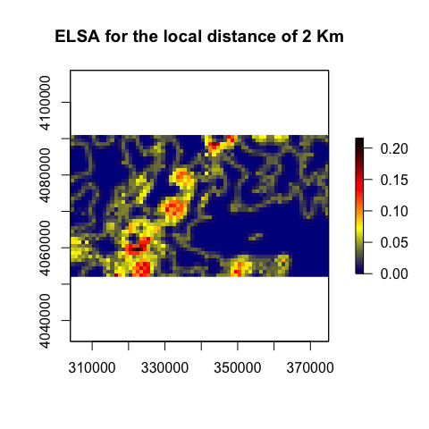

    # ELSA statistic for the local distance of 4Km:
    e2 <- elsa(r,d=4000,categorical=FALSE) 

    plot(e2,col=cl, main='ELSA for the local distance of 4 Km')

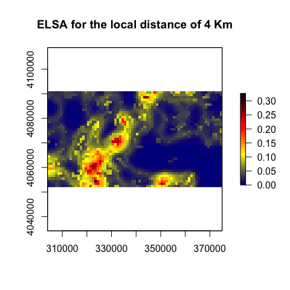

    ##################3
    file <- system.file('external/lc_example.grd',package='elsa') 

    lc <- raster(file)

    plot(lc,main='Land cover: a categorical map')

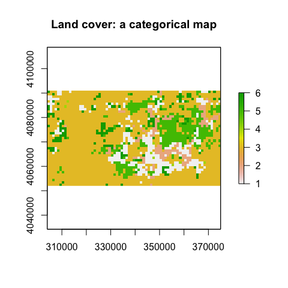

    elc <- elsa(lc, d=2000,categorical = T)

    plot(elc, col=cl, main='ELSA')

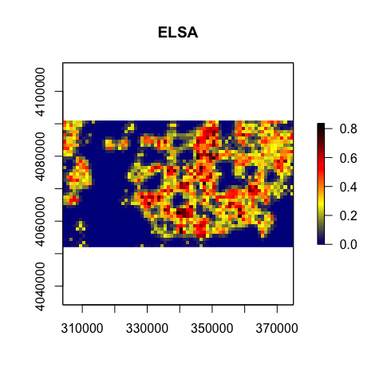

The distance argument (d) needs to be specified by a user and its unit
should be in the map unitthat is relevant to the projection of the
dataset. If a dataset has a metric projection, the distance is specified
in meters, and if the dataset has a geographic coordinate system, the
distance should be in decimal degress.

Entrogram: A variogram-like graph to explore the global spatial structure:
--------------------------------------------------------------------------

The same as variogram, **Entrogram** is a function describing the degree
of spatial dependence of a spatial dataset. Entrogram is a novel method
that uses the new spatial statistic, ELSA, to calculate global spatial
structure. This function, can be used to check the global spatial
dependence for both continous and categorical data. Width is the lag
size (width of subsequent distance intervals) into which cell pairs are
grouped for ELSA estimates. cutoff is the spatial separation distance up
to which cell pairs are included in the entrogram estimates.

    file <- system.file('external/dem_example.grd',package='elsa') 

    r <- raster(file) # reading a raster map (Dogital Elevation Model: DEM)

    plot(r, main='DEM: a continuous raster map')

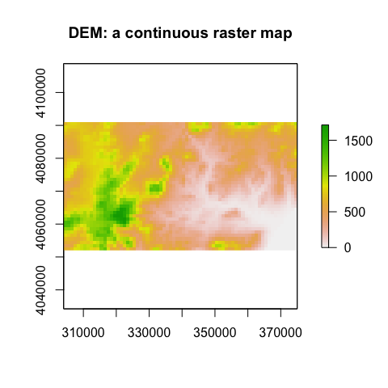

    en <- entrogram(r, width = 2000, cutoff = 15000)

    ## the input is considered as a continuous variable...

    plot(en)

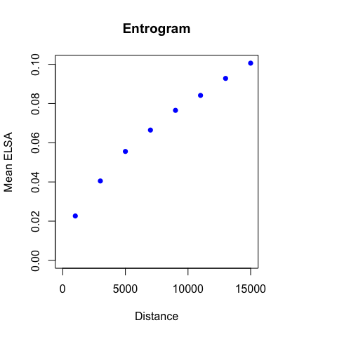

    #######
    file <- system.file('external/lc_example.grd',package='elsa') 

    lc <- raster(file)

    plot(lc,main='Land cover: a categorical map')

    en2 <- entrogram(lc, width = 2000, cutoff = 15000)

    ## the input is considered as a categorical variable...

    plot(en2)

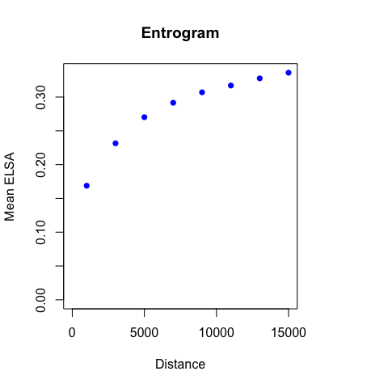

Using elsa to calculate other spatial autocorrelation statistics:
-----------------------------------------------------------------

In the elsa package, several fucntions are also implemented that can be
used to calculate state-of-the-art metrics.

### Calculate LISAs:

You can use functions to easily (user friendly) calculate LISA metrics
including local Moran’s I, local Geary’s c, local G & G\* . To do that,
just use the **lisa** function:

    ## LISAs can be used only for continuous data:
    file <- system.file('external/dem_example.grd',package='elsa') 

    r <- raster(file) # reading a raster map (Dogital Elevation Model: DEM)

    plot(r, main='DEM: a continuous raster map')

    # calculate Local Moran's I:
    lisa.i <- lisa(r, d1=0,d2=2000,statistic='I')

    plot(lisa.i,col=cl,main="Local Moran's I")

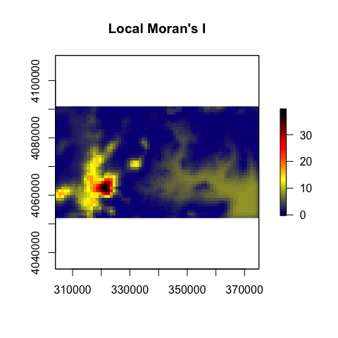

    # calculate Local Geary's c:
    lisa.c <- lisa(r, d1=0,d2=2000,statistic='c')

    plot(lisa.c,col=cl,main="Local Geary's c")

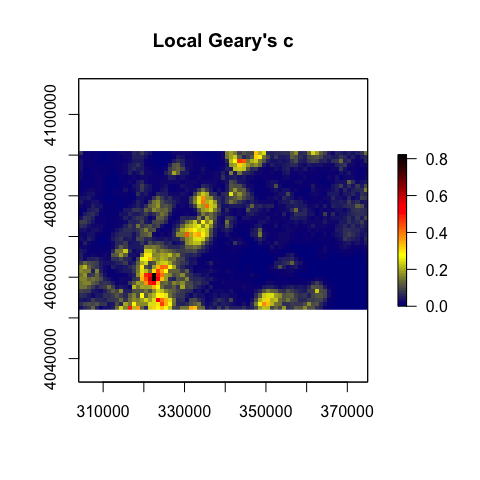

    # calculate Local G or G*:
    lisa.g <- lisa(r, d1=0,d2=2000,statistic='g*')

    plot(lisa.g,col=cl,main="Local G*")

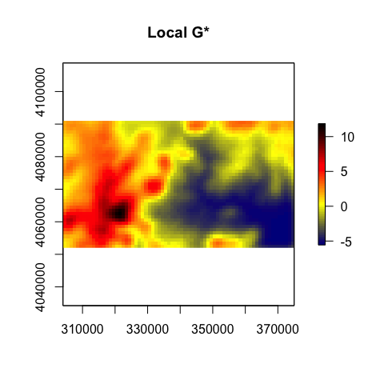

    # Calculate Variogram:

    v <- Variogram(r, width = 2000, cutoff = 15000)

    plot(v)

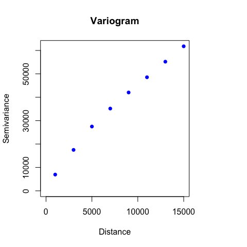

    # Calculate Correlogram:
    co <- correlogram(r, width = 2000, cutoff = 15000)

    plot(co)

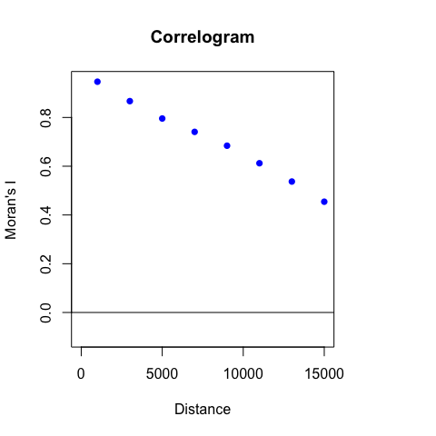

### calculate global statistics:

In the package, some functions to calculate global spatial
autocorrelation are also implemented:

    file <- system.file('external/dem_example.grd',package='elsa')
    r <- raster(file)

    # Moran's I index:
    moran(r, d1=0, d2=2000)

    ## [1] 0.9466577

    # Geary's c index:
    geary(r, d1=0, d2=2000)

    ## [1] 0.06057294

More details about ELSA:
------------------------

Unlike the other spatial statistics, ELSA can also be used for
multi-class categorical data (e.g., Land cover data). Categorical
variables are typically conceptualized as having no inherent ordering,
which means that all pairs of categories are equally dissimilar. The
assumption that all categories are equally dissimilar is often an
oversimplification. Several studies have been conducted to estimate a
measure of dissimilarity between categories. Categories may also be
classified into a hierarchical structure. It means that, for example,
two classes of ‘mixed forest’, and ‘coniferous forest’ is the
sub-classes of the main ‘forest’ class, and ‘olive groves’, ‘vineyards’
are also sub-classes of the “Agriculture” main class. In this example,
the sub-class of ‘vineyards’ is the less dissimilar to ‘olive groves’
than to ‘coniferous forest’. The levels of dissimilarities can be
specified when calculating ELSA for such the categorical data,
otherwise, similar levels of dissimilarities are considered for all
pairs (for more details, see Naimi et al. (2019)).

The argument *dif* in the elsa function can be used to define different
weights of similarity between each pair of categories when the level of
similarity is not the same between different classes in the variable.
For example, two categories belong to two forest types are more similar
than two categories, one a forest type and the other one an agriculture
type. So, it can take this differences into account when the spatial
autocorrelation for categorical variables is quantified. The *dif*
argument requires a list, but the dissimilarities may be easier to be
defined into a data.frame, then the function *dif2list* can convert it
to the list required by the *dif* argument.

    # imagine we have a categorical map including 4 classes (values 1:4), and the first two classes
    # (i.e., 1 and 2) belong to the major class 1 (so can have legends of 11, 12, respectively), and
    # the second two classes (i,e, 3 and 4) belong to the major class 2 (so can have legends of 21,
    # and 22 respectively). Then we can construct the data.frame as:

    d <- data.frame(g=c(1,2,3,4),leg=c(11,12,21,22))

    d

    ##   g leg
    ## 1 1  11
    ## 2 2  12
    ## 3 3  21
    ## 4 4  22

    # dif2list generates a list including 4 values each corresponding to each value (class in the map
    #, i,e, 1:4). Each item then has a numeric vector containing a relative dissimilarity between the
    # main class (the name of the item in the list) and the other classes. If one wants to change 
    # the relative dissimilarity between two specific classes, then the list can easily be edited and
    # used in the elsa function

    dif2list(d)

    ## $`1`
    ## 1 2 3 4 
    ## 0 1 2 2 
    ## 
    ## $`2`
    ## 1 2 3 4 
    ## 1 0 2 2 
    ## 
    ## $`3`
    ## 1 2 3 4 
    ## 2 2 0 1 
    ## 
    ## $`4`
    ## 1 2 3 4 
    ## 2 2 1 0
